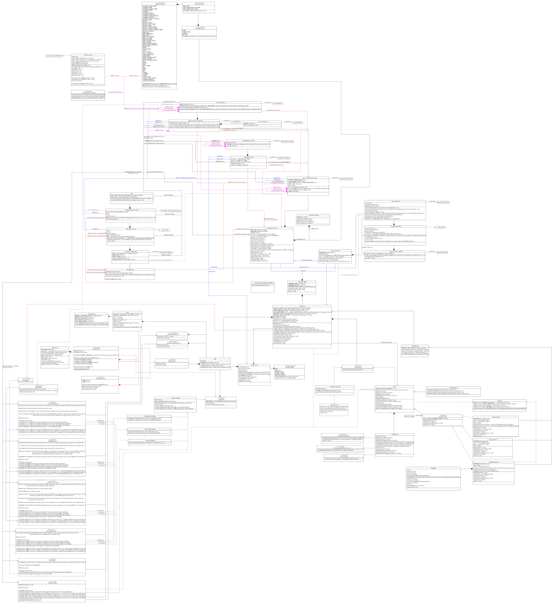

# Note!
The program requires a working connection to the internet and using a VPN might
make the suggestions provided somewhat weird as the program uses the machine's
public IP to favour search results in the same country.

The use of this program requires a valid API key (NOT INCLUDED!) to the
OpenWeatherAPI and that the key has been run through the KeyGen (found in
package fi.tuni.prog3.keygen). The recommended encrypted key location and name
is: "{working_dir}/secrets/ApiKeys/OpenWeather".

If used with another location than the one specified above, the file (with
location) must be supplied as the first commandline argument to WeatherApp.

If for some reason the encryption system doesn't work or the user can't be
bothered with using it, it can be nerfed by a quick modification to
Key.Java.

For bugs/todos see TODO.md

# 1. Program structure and instructions

This program has been mainly divided into two different sections:
1) The frontend
2) The backend

## 1.1 Frontend structure and instructions for use

The frontend consists of one JavaFX stage (window) that then either displays a
search scene or a weather scene to the user.

### 1.1.1 Search scene

The search scene consists of all a query field where the user can type a cities
name and possibly a country code to specify the country (separated with ", ").

If the user clears the text-field they are displayed with their favourite cities
and search history. As the user also starts to type for some city the program
provides the user with some suggestions. To use an entry from the suggestion box
simply click on the entry. Also pressing enter once ready with the typed query
works as well.

Before querying for a result the user can also specify what units should be used.
This is done by selecting the preferred unit from the dropdown under

### 1.1.2 Weather scene

Once the user queries for a city the program will switch from the search scene
to the weather scene. If the user's query was erroneous (query wasn't found
from the OpenWeather database), the user is simply prompted with a message of
this error.

If the user's query was OK, the user will be provided with the following views
or panes:
1) Current weather at the location
2) Daily weather forecast
3) Hourly weather forecast or 5-day forecast with 3 hour steps (depends on the
on if the supplied API key has the permissions for the hourly forecasts)
4) A weather map centered around the given location

As the weather map by default consists of a 10x10 grid of images with 6 layers
(1 base map + 5 weather layers) the program has to make 600 api calls it might
take a few seconds for the map to appear (happens mostly in parallel but still
might have a small delay). As this happens asynchronously, the text "Map is 
loading..." is displayed while the map formation takes place. Panning the map
happens with scrolling (shift for horizontal) and selecting the weather layer
happens from the dropdown on top of the map (top left corner).

To favourite a search result press the star symbol at the top of the window.
To un-favourite uses the same mechanism.

To return to the search scene to press the magnifying glass symbol next to
the star symbol.

To delete search history can also be done from the "Reset history" button.

## 1.2 Backend structure

The backend can be divided into "APIs" and "databases". These APIs are classes
that can make API calls and databases are classes that work with local
data. The backend can be divided into the following:
1) IPService (singleton for managing the IP_Getter API class)
2) OpenWeather API class
3) MaxMindGeoIP2 database class
4) Cities database class

To better understand the functionality of how API classes especially
function, it strongly recommended to go and read the README.md files found
inside:
[/backend/api/general/](../src/main/java/fi/tuni/prog3/weatherapp/backend/api/general)

### 1.2.1 IPService and IP_Getter

IP_Getter is a class that provides functionality for gaining the machine's
public ip address. IP_Getter is class or a "structure" which only contains
other classes/records which can be used for forming an IP_Getter API and then
multiple different methods used to construct "callables" for the IP_Getter API
(see
[/backend/api/general/README.md](../src/main/java/fi/tuni/prog3/weatherapp/backend/api/general/README.md)
for a more concrete 
explanation of "callables").

IPService is basically an extension of IP_Getter as it simply is a singleton
that goes through all the different defined callables in IP_Getter.callables
and sets the IP address to the first valid result. This service can then be
used anywhere around the code with simply calling IPService.getInstance().

## 1.2.2 OpenWeather API

This project utilizes the OpenWeather API for weather data. The OpenWeather API
is called with just the API class, which is supplied with a so called "callable"
(see
[/backend/api/general/README.md](../src/main/java/fi/tuni/prog3/weatherapp/backend/api/general/README.md))
that dictates the actual call url
and the arguments passed. The responses to these calls can then be turned to
their corresponding Java objects found from inside the same class as the
callables themselves.

This fact can be utilized when making calls through the backend.

In addition to OpenWeather API calls the OpenWeather class is actually also able
to call the OpenStreetMaps API in the WeatherMaps classes.

## 1.2.3 MaxMindGeoIP2 database

The MaxMindGeoIP2 database is a class that supplies is able to load the MaxMind
GeoLite 2 Cities database and query it for an approximate geolocation based on
a given IP address.

## 1.2.4 Cities database

For frontend to supply valid city suggestions the program includes a custom
Cities database that contains all the possible cities in OpenWeather, and it
supplies the top N guesses of what the user is trying to search for which the
frontend then displays to the user. For a more in-depth description see the
README.md files located inside:
[/backend/database/Cities/](../src/main/java/fi/tuni/prog3/weatherapp/backend/database/cities)

# 2 Features and requirements

| Requirements                                                           | Status/Location |
|------------------------------------------------------------------------|-----------------|
| The program compiles                                                   | Yes             |
| The program uses the course provided user interface as its main window | Uses custom     |
| The program allows the user to search for different locations          | Yes             |
| The program displays the current weather and a simple forecast         | Yes             |
| The program uses the weather icons provided by OpenWeatherMap          | Uses custom     |
| Uses at least one of the provided interfaces                           | Kinda1     |
| The project version history is visible in gitlab                       | Yes2       |
| A final document                                                       | Yes             |
| A graphical user interface has been implemented by the team            | Yes, me         |
| The program allows saving locations as favourites                      | Yes             |
| The state of the program is saved                                      | Yes             |
| Instead of the simple forecast a more detailed forecast is implemented | Yes             |
| The program uses a custom set of icons                                 | Yes3       |
| The program handles errors during file processing                      | Yes4       |
| Unit tests have been implemented for the program                       | Small, but yes  |

1 = The these interfaces don't exist anymore, as they didn't make any sense to
keep. I could have implemented some class that writes some string to a file at
the start and reads it just to conform to this requirement. As I thought this
was a useless feature I left it out as I also believe my code does show I
understand interfaces in Java.

2 = See responsibilities section below.

3 = I made a completely new set of svg images with Adobe Illustrator of basic
weather symbols and turned them into a font. Basically all icons that are
displayed are composite glyphs, which allowed me to squeeze the font file to
6kb. The actual font can be viewed by opening the .sfd file with FontForge.
Original inspiration for this method:
<https://www.reddit.com/r/Windows11/comments/1blat1r/windows_uses_fonts_for_loading_bars/>

4 = Nuking MaxMind GeoLite2 and Fonts may result in the app not working (untested).
I would have added a similar system to GeoLite as I did with Cities
(loading from the web), but as this is behind an account I did not feel
comfortable implementing such a solution and as I think this is more intended
to relate to userdata.

In addition to the requirements the program also has quite a few additional
features. The additional features implemented: 
1) Weather Maps
2) Location search history
3) Supporting multiple systems of units of measurement
4) Own features:
   1) Public IP extraction and conversion to geolocation
   2) Suggestive autofill and cities database
   3) Parallel processing in most computationally expensive (aka slow) functions
   4) API Key encryption and decryption

# 3 Responsibilities

This has completely been a one-man-show so 100% my very own work. This project
has required me to pull 3 all-nighters so arguably is as far as I could have
reached during this time limit. Also, as I started this project before
receiving my gitlab repo, most of the work at the start was done over at my
GitHub (<https://github.com/JoonasOT/OpenWeatherTesting>) so a more detailed
history of the starting commits can be found from there.

# 4 The UML class diagram

The best descriptions of class responsibilities etc. can be found from the
README.md files in each directory and from code comments.

The most recent version of the UML class diagram is the following (is a svg image
so feel free to zoom as much as you like):

Note! This is not an excellent depiction of the classes included, but is the
best I can do with my limited time.

